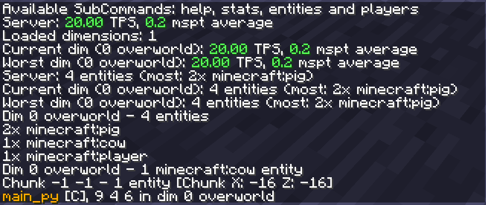

# RozUtils

RozUtils contains a HUD that can display various data about the server status, dimension data, etc. as well as a command for more exact tinkering.

**Needs to be installed both on the client and server to work**  

Example HUD configuration  
  
Command example  

## Dependencies

  
RozUtils is written in Kotlin, and as such requires Forgelin Continuous to be present.
