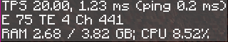

# RozHUD

RozHUD is a highly configurable and minimalistic HUD targeted at mod/modpack authors and server admins, but can be used by anyone.  
It can display data like server TPS, MSPT, ping, loaded entity count, RAM and CPU usage, and some more.

**Needs to be installed both on the client and server to work**  

Example configuration  

## Dependencies

  
RozHUD is written in Kotlin, and as such requires Forgelin Continuous to be present.
